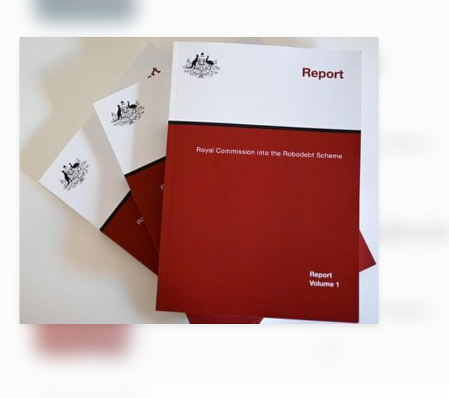
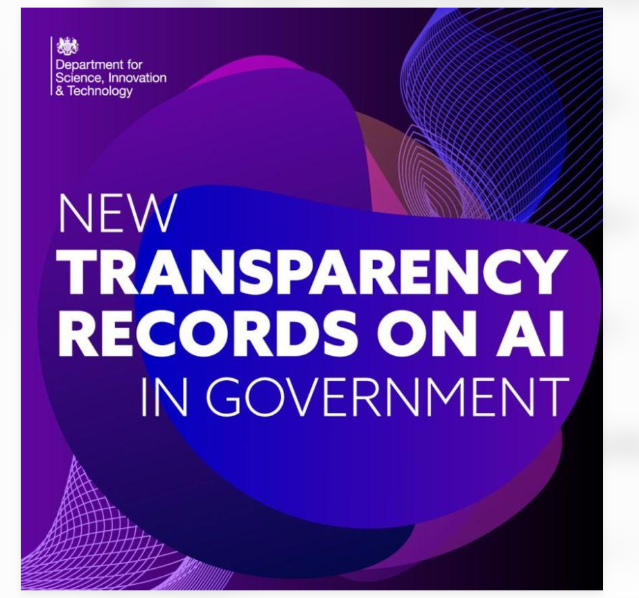
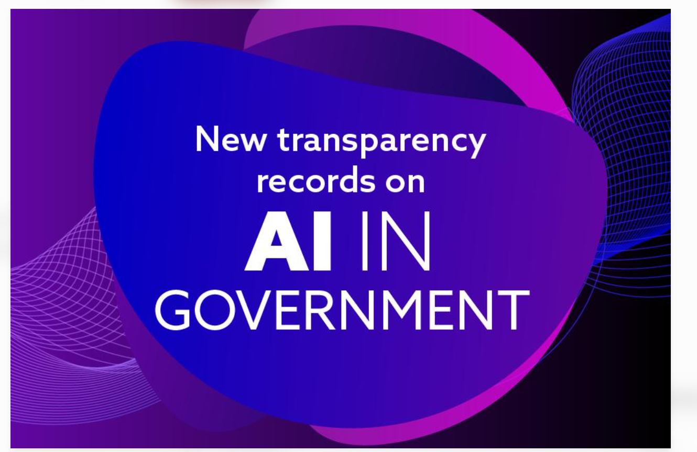

# E-Portfolio 5 – Automated Decision Making in Government

**Unit:** COIT11223 – ICT Ethics and Governance in Society  
**Assessment:** Assessment 3 – Question 2  
**Student:** Umesh Kunwar  
**Student ID:** 12301486

## Introduction

Automated Decision Making, or ADM, employs algorithms or computerized systems to help making decisions. The use of ADM by governments is very helpful in improving services, processing data and supporting governmental decisions. However, the use of ADM technologies carries ethical risks as well, such as unjust treatment, infringement of privacy, low transparency and inadequate accountability. This paper describes six contemporary sources from the Australian and the UK governments. It also assesses the accountability of IT professionals according to ethical theories and the Code of Professional Conduct by the Australian Computer Society.

## Artefact 1 – National Framework for AI Assurance in Government (2024)

**Country:** Australia  
**Source:** Australian Government Department of Finance

**Summary**

The publication of the National Framework for Assurance of Artificial Intelligence in Government occurred in June 2024. This document creates the common method for all governments of Australia in dealing with AI risks. The document links principles of responsible AI to ethical principles and government accountability. The document emphasizes the necessity of checking if AI systems are suited for their purpose, safe and functioning properly (Data and Digital Ministers Meeting 2024).
**Personal reflection**

This artefact helped me to realize that a test of an automated system should not only be about checking the technical accuracy. I would also like to consider if it has a negative impact on specific groups. This is related to Rule Utilitarianism because if reliable safeguards can be implemented, then they can enhance the results of society as a whole. It also demonstrates the ACS principle of the public interest.

**Artefact evidence:**

*Source: [Official government artefact 1](https://www.finance.gov.au/government/public-data/data-and-digital-ministers-meeting/national-framework-assurance-artificial-intelligence-government).*

## Artefact 2 – OAIC Consultation on Government ADM (2025)

**Country:** Australia  
**Source:** Office of the Australian Information Commissioner

**Summary**

The OAIC has submitted a report to government on use of automated decision making in January 2025. It raises awareness about the importance of transparency and protection for individuals who are subject to automated decision-making. Risks related to personal information and the ability of individuals to appreciate or contest decisions are also pointed out. Such concerns are especially relevant in the context of ADM's impact on access to public services (OAIC 2025).

**Personal reflection**

I chose this artefact as I felt it highlighted the issue of whether people have any control when the government uses their personal information. I think that an automated decision should be explained and reviewed upon request. This is a link to Kantian ethics, which is about respecting individuals, and the ACS values of honesty and quality of life.

**Artefact evidence:**

*Source: [Official government artefact 2](https://www.oaic.gov.au/engage-with-us/submissions/agd-consultation-paper-use-of-automated-decision-making-by-government).*

## Artefact 3 – Automated Decision-Making and Public Reporting (2026)

**Country:** Australia  
**Source:** Office of the Australian Information Commissioner

**Summary**

This OAIC report is an analysis of public reporting relating to automated decision making in Australia's freedom of information framework. It takes into account the way in which government agencies publish information about their use of ADM and the necessity to have access to this information. Public reporting may provide insight into the use of automated processes in government operations and enhance accountability for decisions that impact the community (OAIC 2026).

**Personal reflection**

I think about information vs. communication with this artefact. Technical explanations might be hard for the average person to grasp. I believe it is the role of ICT professionals to contribute with the development of accurate and accessible explanations. Virtue Ethics fosters honest behavior and responsible professional conduct, and the ACS Code is in line with these values.

**Artefact evidence:**

*Source: [Official government artefact 3](https://www.oaic.gov.au/freedom-of-information/information-commissioner-decisions-and-reports/foi-reports/Automated-decision-making-and-public-reporting-under-the-Freedom-of-Information-Act).*

## Artefact 4 – Robodebt Royal Commission Implementation Update (2026)

**Country:** Australia  
**Source:** Department of the Prime Minister and Cabinet

**Summary**

The March 2026 implementation update is linked to the recommendations of the Robodebt Royal Commission, and the Australian Government's response to these recommendations. Robodebt was not a system of modern generative-AI, rather it was a combination of illegible automated income averaging and administrative procedures. It demonstrates the risks of not adequately protecting and monitoring the assessment of government debt and administration. This source is relevant to ADM as it addresses the issue of lawful decision making; of accountability of organisations; and of the protection of people affected by government systems (Department of the Prime Minister and Cabinet 2026).

**Personal reflection**

I selected this artefact as it shows the definite impact of technology on people. It made me think of how should ICT professionals care about systems that will negatively affect the organisation when it is driven to speed up? In both programs, the consequences are considered; in the latter, respect for individuals and duties. Both methods may be employed in promoting higher protection levels.

**Artefact evidence:**

*Source: [Official government artefact 4](https://www.pmc.gov.au/sites/default/files/resource/download/robodebt-royal-commission-implementation-update-march-2026.pdf).*

## Artefact 5 – Algorithmic Transparency Recording Standard Guidance (updated 2025)

**Country:** United Kingdom  
**Source:** UK Government Digital Service

**Summary**

The Algorithmic Transparency Recording Standard in the United Kingdom aims at providing recommendations to public sector organisations regarding the documentation of algorithmic techniques. It provides practical examples of how organisations can articulate the meaning of a given technique and its impact on decision-making. The goal of this standard is to enhance transparency in cases where algorithms are used for making decisions that have impact on the public (Government Digital Service 2025).

**Personal reflection**

The artefact I am going to analyse is informative in nature as it explains how technologies developed by gov agencies function for the public. It is my opinion that trust from citizens can be gained not solely by stating that the system is successful but also by ensuring people realise when algorithms interfere into significant decisions. It is associated with Social Contract Theory as well as with the principle of honesty of the ACS.

**Artefact evidence:**

*Source: [Official government artefact 5](https://www.gov.uk/government/publications/guidance-for-organisations-using-the-algorithmic-transparency-recording-standard/algorithmic-transparency-recording-standard-guidance-for-public-sector-bodies).*

## Artefact 6 – Mandatory Algorithmic Transparency Policy (2024)

**Country:** United Kingdom  
**Source:** UK Government Digital Service

**Summary**

The United Kingdom's government brought out its compulsory policy on scope and exemptions of algorithmic transparency recording standard in December 2024. The policy identifies the central government organizations and algorithmic tools that should be accounted for in relation to transparency recordings. It explains how sensitive information can be preserved with the help of exemptions. The policy illustrates how formal requirements can encourage making facts known about algorithmic systems in use in government sectors (Government Digital Service 2024). 

**Personal reflection**

This artifact enabled me to compare the ideas of assurance and oversight emphasized by Australia with the formal approach to transparency reporting applied by the United Kingdom. I believe that both approaches may be useful; however, each of them does not ensure yet that decisions will be made fairly. The idea of rule utilitarianism allows for the establishment of reliable governance standards while the value of competence by ACS underlines the significance of being a professional with certain knowledge.

**Artefact evidence:**

*Source: [Official government artefact 6](https://www.gov.uk/government/publications/algorithmic-transparency-recording-standard-mandatory-scope-and-exemptions-policy/algorithmic-transparency-recording-standard-atrs-mandatory-scope-and-exemptions-policy).*

## Overall Reflection

Prior to my research on this subject, ADM was understood by me as the means to manage data and improve efficiency. The materials used in the paper present a broader picture of the ethical obligations linked to the influence of automated systems on the judicial process.
The examples given for Australia refer to the issues of assurance, privacy, accountability, and the outcome of bad administration. The examples from the UK emphasize the significance of making information regarding the algorithmic tools available for the general public.
Kantian ethics stresses the responsibilities and concerns of people, in the same way the utilitarianism approach draws attention to the outcomes of decisions. The ACS Code represents professional principles, such as public interest, quality of life, honesty, and professionalism.

## References

Australian Computer Society (ACS) 2014, *ACS Code of Professional Conduct*, version 2.1, Australian Computer Society, <https://www.acs.org.au/content/dam/acs/rules-and-regulations/Code-of-Professional-Conduct_v2.1.pdf>.

Data and Digital Ministers Meeting 2024, *National framework for the assurance of artificial intelligence in government*, Australian Government, <https://www.finance.gov.au/government/public-data/data-and-digital-ministers-meeting/national-framework-assurance-artificial-intelligence-government>.

Department of the Prime Minister and Cabinet 2026, *Robodebt Royal Commission implementation update – March 2026*, Australian Government, <https://www.pmc.gov.au/sites/default/files/resource/download/robodebt-royal-commission-implementation-update-march-2026.pdf>.

Government Digital Service 2024, *Algorithmic Transparency Recording Standard (ATRS) mandatory scope and exemptions policy*, UK Government, <https://www.gov.uk/government/publications/algorithmic-transparency-recording-standard-mandatory-scope-and-exemptions-policy/algorithmic-transparency-recording-standard-atrs-mandatory-scope-and-exemptions-policy>.

Government Digital Service 2025, *Algorithmic Transparency Recording Standard – guidance for public sector bodies*, updated 8 May 2025, UK Government, <https://www.gov.uk/government/publications/guidance-for-organisations-using-the-algorithmic-transparency-recording-standard/algorithmic-transparency-recording-standard-guidance-for-public-sector-bodies>. 

Office of the Australian Information Commissioner (OAIC) 2025, *AGD consultation paper – Use of automated decision making by government*, Australian Government, <https://www.oaic.gov.au/engage-with-us/submissions/agd-consultation-paper-use-of-automated-decision-making-by-government>.

Office of the Australian Information Commissioner (OAIC) 2026, *Automated decision-making and public reporting under the Freedom of Information Act*, Australian Government, <https://www.oaic.gov.au/freedom-of-information/information-commissioner-decisions-and-reports/foi-reports/Automated-decision-making-and-public-reporting-under-the-Freedom-of-Information-Act>.

