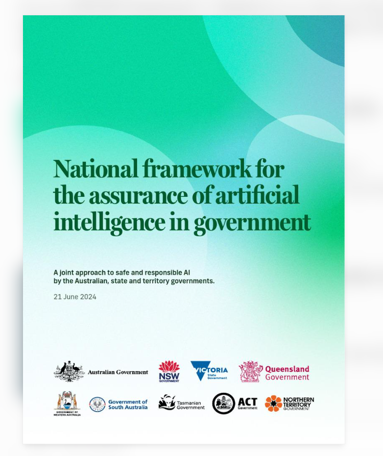
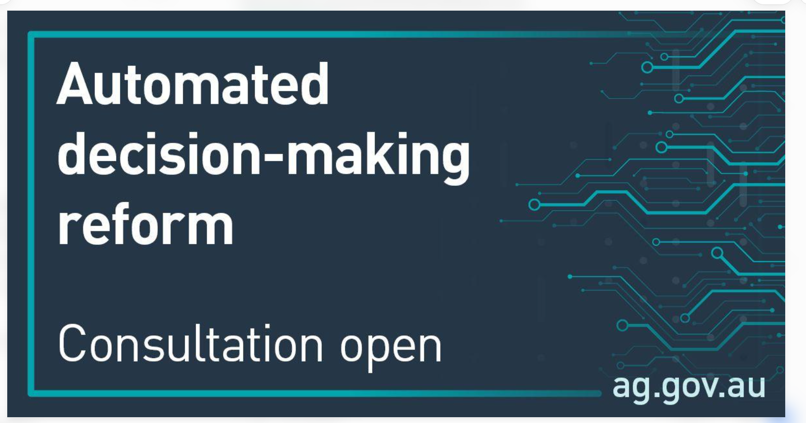

# E-Portfolio 5 – Automated Decision Making in Government

**Unit:** COIT11223 – ICT Ethics and Governance in Society  
**Assessment:** Assessment 3 – Question 2  
**Student:** Umesh Kunwar  
**Student ID:** 12301486

> **Before submitting:** Upload six authentic screenshots to the `images/` folder using the exact names shown below. The screenshots are not included in this file. Verify source dates, references, and rewrite reflections in your own words.

## Introduction

Automated Decision Making (ADM) refers to the use of algorithms or computer systems to make or assist decisions. Governments can use ADM to improve service delivery, process information and support administrative decisions. However, these systems may also create ethical risks, including unfair treatment, privacy violations, limited transparency and inadequate accountability. This e-portfolio examines six recent government sources from Australia and the United Kingdom. It considers the responsibilities of ICT professionals through ethical theories and the Australian Computer Society (ACS) Code of Professional Conduct.

## Artefact 1 – National Framework for AI Assurance in Government (2024)

**Country:** Australia  
**Source:** Australian Government Department of Finance

**Summary**

The National Framework for the Assurance of Artificial Intelligence in Government was released in June 2024. It establishes a shared approach for Australian governments to assess and manage AI risks. The framework connects responsible AI practices with ethical principles and government accountability. It highlights the importance of checking whether AI systems are appropriate, safe and operating as intended (Australian Government et al. 2024).

**Personal reflection – revise in your own words**

This artefact helped me understand that testing an automated system should involve more than checking its technical accuracy. I would also want to examine whether it creates unfair outcomes for particular groups. This connects with Rule Utilitarianism because applying reliable safeguards can improve outcomes across society. It also reflects the ACS principle of putting the public interest first.

**Artefact evidence:** 

## Artefact 2 – OAIC Consultation on Government ADM (2025)

**Country:** Australia  
**Source:** Office of the Australian Information Commissioner

**Summary**

In January 2025, the OAIC published a submission about government use of automated decision-making. It discusses the need for transparency and safeguards to protect people affected by automated decisions. The submission also highlights risks involving personal information and individuals' ability to understand or challenge decisions. These concerns are particularly important when ADM influences access to public services (OAIC 2025).

**Personal reflection – revise in your own words**

I selected this artefact because it raises the question of whether people have meaningful control when governments use their personal information. I believe an individual should be able to seek an explanation and request a review when an automated decision affects them. This connects with Kantian ethics, which emphasises respecting individuals, and the ACS values of honesty and quality of life.

**Artefact evidence:**

## Artefact 3 – Automated Decision-Making and Public Reporting (2026)

**Country:** Australia  
**Source:** Office of the Australian Information Commissioner

**Summary**

This OAIC report examines public reporting about automated decision-making under Australia's freedom of information framework. It considers how government agencies disclose information about their use of ADM and the importance of making this information accessible. Public reporting can help people understand whether automated processes are involved in government administration and can strengthen scrutiny of decisions that affect the community (OAIC 2026).

**Personal reflection – revise in your own words**

This artefact made me think about the difference between making information available and communicating it clearly. Technical explanations may be difficult for ordinary citizens to understand. I think ICT professionals should help create explanations that are accurate and accessible. Virtue Ethics encourages honesty and responsible professional behaviour, while the ACS Code supports truthful communication and public accountability.

**Artefact evidence:**

## Artefact 4 – Robodebt Royal Commission Implementation Update (2026)

**Country:** Australia  
**Source:** Department of the Prime Minister and Cabinet

**Summary**

The March 2026 implementation update concerns the Australian Government's response to recommendations following the Robodebt Royal Commission. Robodebt illustrates the serious consequences that can arise when government debt assessment and administrative processes lack appropriate safeguards and oversight. This source is relevant to ADM because it demonstrates the importance of lawful decision-making, organisational accountability and protecting people affected by government systems (Department of the Prime Minister and Cabinet 2026).

**Personal reflection – revise in your own words**

I selected this artefact because it shows that technology-related decisions can have significant human consequences. It made me consider why ICT professionals should raise concerns about systems that may cause harm, even when an organisation is under pressure to work quickly. Act Utilitarianism encourages examining consequences, while Kantianism emphasises duties and respect for individuals. Both approaches can support stronger safeguards.

**Artefact evidence:**

## Artefact 5 – Algorithmic Transparency Recording Standard Guidance

**Country:** United Kingdom  
**Source:** UK Government Digital Service

**Summary**

The UK's Algorithmic Transparency Recording Standard provides guidance to public-sector organisations about recording and publishing information on algorithmic tools. It explains how organisations can describe a tool's purpose, its role in decision-making and relevant oversight arrangements. This approach aims to improve transparency when algorithmic systems influence decisions affecting the public (Government Digital Service, publication year to verify).

**Personal reflection – revise in your own words**

I chose this artefact because it offers a practical example of explaining government technology to citizens. I think public trust depends on more than saying that a system is efficient. People should understand when an algorithm influences important decisions. This connects with Social Contract Theory, which considers the relationship between public institutions and citizens, and with the ACS principle of honesty.

**Artefact evidence:**

## Artefact 6 – Mandatory Algorithmic Transparency Policy (2024)

**Country:** United Kingdom  
**Source:** UK Government Digital Service

**Summary**

The UK Government published its mandatory scope and exemptions policy for the Algorithmic Transparency Recording Standard in December 2024. It identifies which central government organisations and algorithmic tools must be covered by transparency records. It also explains how sensitive information can be protected through exemptions. The policy demonstrates how formal requirements can encourage disclosure about algorithmic systems used in public administration (Government Digital Service 2024).

**Personal reflection – revise in your own words**

This artefact helped me compare Australia's emphasis on assurance and oversight with the UK's formal transparency reporting approach. I think both approaches have value, but neither automatically guarantees fair decisions. Governments also need appropriate testing, monitoring and human review. Rule Utilitarianism supports dependable governance rules, while the ACS value of competence highlights the importance of professional knowledge and responsibility.

**Artefact evidence:**

## Overall Reflection

Before researching this topic, I understood ADM mainly as a way to process information and improve efficiency. These sources provide a broader view of the ethical responsibilities involved when automated systems affect government decisions.

The Australian examples focus on assurance, privacy, accountability and the consequences of poor administrative practices. The UK examples demonstrate the importance of publishing information about algorithmic tools.

Kantianism highlights duties and respect for individuals, while utilitarian theories encourage consideration of the consequences of decisions. The ACS Code provides professional guidance through public interest, quality of life, honesty and competence.

**Personalise this reflection:** Explain which source changed your understanding most, what you previously believed, and what you would do differently as a future ICT professional.

## References

Australian Computer Society (ACS) 2014, *ACS Code of Professional Conduct*, version 2.1, Australian Computer Society, <https://www.acs.org.au/content/dam/acs/rules-and-regulations/Code-of-Professional-Conduct_v2.1.pdf>.

Australian Government et al. 2024, *National framework for the assurance of artificial intelligence in government*, Australian Government, <https://www.finance.gov.au/sites/default/files/2024-06/National-framework-for-the-assurance-of-AI-in-government.pdf>.

Department of the Prime Minister and Cabinet 2026, *Robodebt Royal Commission implementation update – March 2026*, Australian Government, <https://www.pmc.gov.au/sites/default/files/resource/download/robodebt-royal-commission-implementation-update-march-2026.pdf>.

Government Digital Service 2024, *Algorithmic Transparency Recording Standard (ATRS) mandatory scope and exemptions policy*, UK Government, <https://www.gov.uk/government/publications/algorithmic-transparency-recording-standard-mandatory-scope-and-exemptions-policy/algorithmic-transparency-recording-standard-atrs-mandatory-scope-and-exemptions-policy>.

Government Digital Service, *Algorithmic Transparency Recording Standard – guidance for public sector bodies*, UK Government, <https://www.gov.uk/government/publications/guidance-for-organisations-using-the-algorithmic-transparency-recording-standard/algorithmic-transparency-recording-standard-guidance-for-public-sector-bodies>. **Verify publication year before submission.**

Office of the Australian Information Commissioner (OAIC) 2025, *AGD consultation paper – Use of automated decision making by government*, Australian Government, <https://www.oaic.gov.au/engage-with-us/submissions/agd-consultation-paper-use-of-automated-decision-making-by-government>.

Office of the Australian Information Commissioner (OAIC) 2026, *Automated decision-making and public reporting under the Freedom of Information Act*, Australian Government, <https://www.oaic.gov.au/freedom-of-information/information-commissioner-decisions-and-reports/foi-reports/Automated-decision-making-and-public-reporting-under-the-Freedom-of-Information-Act>.

## Use of AI

ChatGPT was used to support planning, identifying potential sources, organising the e-portfolio and preparing a preliminary draft. The final source evaluation, reflections and ethical discussion were reviewed and revised by the student.

**Update this declaration so that it accurately describes your actual use of AI.**

