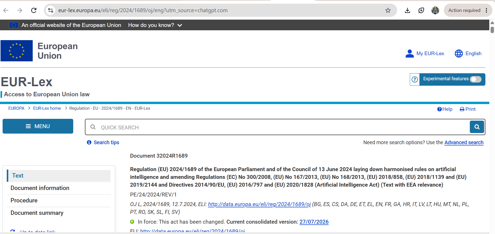

# E-Portfolio 2 – Ethical Theory

**Student Name:** Umesh Kunwar

**Student Number:** 12301486

**Unit:** COIT11223 ICT Ethics and Governance in Society

**Topic:** Ethical Theory and Artificial Intelligence

## Introduction

This e-portfolio demonstrates my understanding of the ethical theories studied during Week 4 of COIT11223 ICT Ethics and Governance in Society. Since my Assessment 1 topic is Artificial Intelligence (AI), I selected four recent AI-related artefacts to demonstrate how ethical theories can be applied to real-world situations. Through these artefacts, I reflect on what I learned about ethical decision-making and how ICT professionals should develop and use AI responsibly (CQUniversity Australia 2026).

---

## Artefact 1 – Week 4 Workshop Participation

### Workshop Evidence

 

### Summary of the Artefact

This artefact provides evidence of my attendance and active participation in the Week 4 workshop for COIT11223. During the workshop, I learned that ethics is the philosophical study of morality and that ethical theories provide different approaches for making responsible decisions. The workshop introduced Kantianism, Act Utilitarianism, Rule Utilitarianism, Social Contract Theory and Virtue Ethics. These theories help ICT professionals analyse ethical issues from different perspectives when developing or using Artificial Intelligence (CQUniversity Australia 2026).

### Reflection and Justification

I selected this artefact because it demonstrates my participation in the workshop and my engagement with the learning activities. Before attending the workshop, I mainly considered the technical advantages of Artificial Intelligence. After learning about ethical theories, I realised that ICT professionals must also consider fairness, privacy, human rights and accountability when developing AI systems. The workshop helped me understand that ethical decision-making is an essential responsibility of every ICT professional.

---

## Artefact 2 – Australian Voluntary AI Safety Standard (2024)

**Source:** https://www.industry.gov.au/publications/voluntary-ai-safety-standard

### Summary of the Artefact

The Australian Government published the Voluntary AI Safety Standard on 5 September 2024 to encourage organisations to develop and use Artificial Intelligence responsibly. The standard outlines principles including accountability, transparency, human oversight, privacy protection, testing and risk management. Its purpose is to improve public trust while reducing the risks associated with AI technologies (Department of Industry, Science and Resources 2024).

### Reflection and Justification

I selected this artefact because it demonstrates how ethical theories can be applied to real-world AI governance. The standard reflects Rule Utilitarianism because organisations follow common rules that maximise benefits and minimise harm for society. It also highlights the responsibility of ICT professionals to ensure AI systems are transparent, safe and fair. This artefact improved my understanding of responsible AI governance in Australia.

---

## Artefact 3 – NIST AI Risk Management Framework (2024)

**Source:** https://www.nist.gov/publications/artificial-intelligence-risk-management-framework-generative-artificial-intelligence

### Summary of the Artefact

The National Institute of Standards and Technology (NIST) published the Artificial Intelligence Risk Management Framework: Generative AI Profile in 2024. The framework provides practical guidance for organisations to identify, assess and manage the risks associated with generative AI systems. It focuses on trustworthiness, transparency, security, privacy, fairness and continuous monitoring throughout the AI lifecycle (National Institute of Standards and Technology 2024).

### Reflection and Justification

I selected this artefact because it demonstrates the importance of identifying AI risks before deployment. The framework relates to Act Utilitarianism because organisations evaluate whether the benefits of AI outweigh the potential harms. This artefact helped me understand that responsible AI requires continuous monitoring and ethical decision-making throughout the development process rather than focusing only on technical performance.

---

## Artefact 4 – European Union Artificial Intelligence Act (2024)

**Source:** https://eur-lex.europa.eu/eli/reg/2024/1689/oj/eng

### Summary of the Artefact

The European Union Artificial Intelligence Act is the world's first comprehensive legal framework regulating Artificial Intelligence. Published in 2024, the Act classifies AI systems according to their level of risk and establishes legal requirements for organisations developing or using AI. It aims to protect human rights, privacy, transparency and public safety while encouraging responsible innovation (European Parliament and Council of the European Union 2024).

### Reflection and Justification

I selected this artefact because it demonstrates how ethical principles influence AI regulation. The Act strongly relates to Social Contract Theory because organisations agree to follow rules that protect the rights of society. It also reflects Kantianism by respecting human dignity and ensuring people are not treated merely as tools within AI systems. This artefact strengthened my understanding that ethical AI requires both technological innovation and effective legal regulation.

---

## Overall Reflection

Completing this e-portfolio improved my understanding of how ethical theories can be applied to Artificial Intelligence. Before attending the Week 4 workshop, I mainly focused on the technical capabilities and benefits of AI. After studying Kantianism, Act Utilitarianism, Rule Utilitarianism, Social Contract Theory and Virtue Ethics, I realised that ICT professionals must also consider fairness, privacy, accountability, human dignity and the wider impact of AI on society.

The four artefacts showed me that governments and professional organisations are developing standards, risk-management frameworks and laws to support the responsible use of AI. One of the most valuable lessons I learned was that no single ethical theory can solve every AI-related issue. Each theory provides a different perspective, so ICT professionals should consider duties, rights, consequences and agreed social rules before making decisions.

This learning has increased my confidence in analysing ethical problems and will help me make more responsible decisions in my future career as an ICT professional.

## Use of Artificial Intelligence

Artificial Intelligence (AI) tools were used during the planning and research stages of this assessment. ChatGPT was used to help generate ideas, identify suitable artefacts, organise the GitHub e-portfolio structure and improve my understanding of the ethical theories covered in Week 4. I independently selected the final artefacts from official sources, verified the information, and edited the final content to ensure it reflects my own understanding, learning and personal reflections in accordance with the assessment requirements.

## References

CQUniversity Australia 2026, *COIT11223 ICT Ethics and Governance in Society – Week 4 Workshop: Ethics and Ethical Theories*, CQUniversity Australia.

Department of Industry, Science and Resources 2024, *Voluntary AI Safety Standard*, Australian Government, viewed 6 August 2026, <https://www.industry.gov.au/publications/voluntary-ai-safety-standard>.

European Parliament and Council of the European Union 2024, *Regulation (EU) 2024/1689 laying down harmonised rules on artificial intelligence*, viewed 6 August 2026, <https://eur-lex.europa.eu/eli/reg/2024/1689/oj/eng>.

National Institute of Standards and Technology 2024, *Artificial Intelligence Risk Management Framework: Generative Artificial Intelligence Profile*, NIST, viewed 6 August 2026, <https://www.nist.gov/publications/artificial-intelligence-risk-management-framework-generative-artificial-intelligence>.
