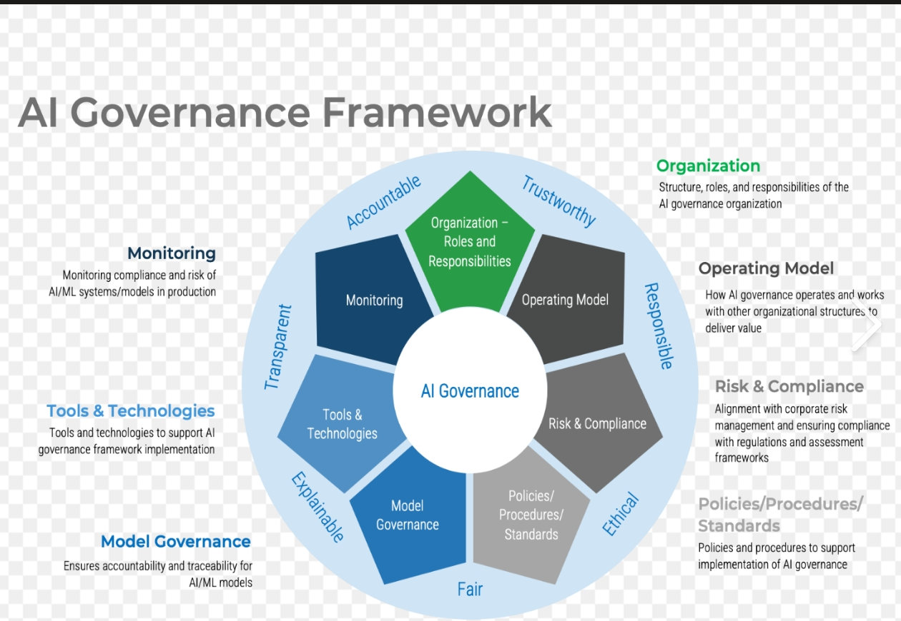
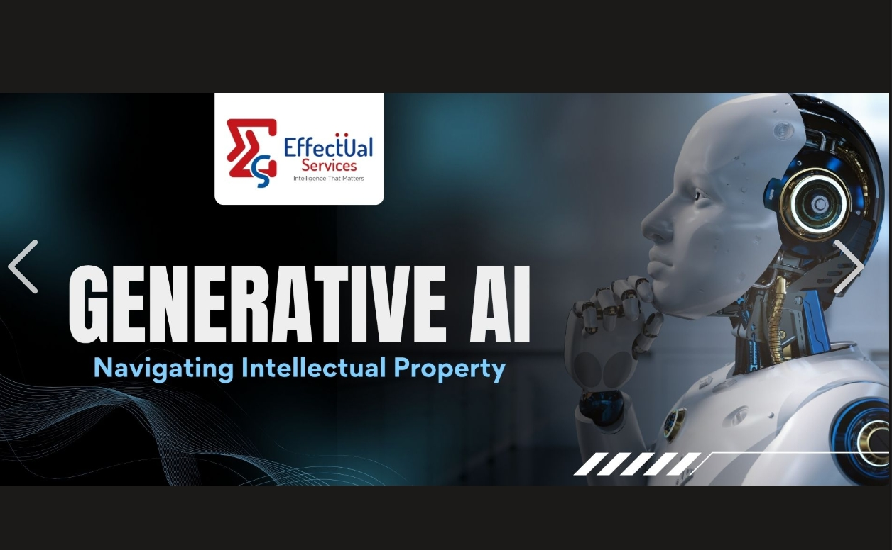
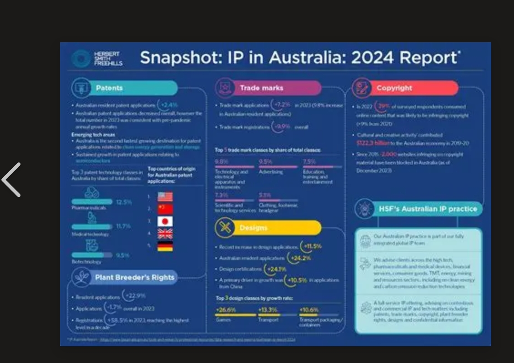

# E-Portfolio 3 – Intellectual Property

**Student Name:** Umesh Kunwar  
**Student Number:** 12301486  
**Unit:** COIT11223 ICT Ethics and Governance in Society  
**Topic:** Intellectual Property  

## Workshop 7 Participation Evidence

This photograph provides evidence of my attendance and participation in the Week 7 workshop on Intellectual Property.

---

## Artefact 1 – Copyright and Artificial Intelligence in Australia

**Source:** Australian Government Attorney-General's Department – Copyright and AI Reference Group Governance Framework

### Summary of the Artefact

The Copyright and AI Reference Group Governance Framework was released by the Australian Government in April 2024. The reference group was created to discuss the existing and new copyright challenges arising from AI and determine potential loopholes and legal uncertainties. In 2024, it worked on the intersection of AI and copyright, understanding the issues and possible solutions (Attorney-General's Department, 2024).

### Reflection and Justification

This artefact was chosen for its ability to illustrate the new challenges for copyright laws with AI technologies. It enabled me to realize the importance of thinking in ICT professionals about the protection of the material used by the AI systems and the respect of the creators' rights. It's related to the copyright and AI discussion this week and just a reminder of the importance of thinking about IP in the development of technology responsibly.

---

## Artefact 2 – Generative AI and Intellectual Property

**Source:** World Intellectual Property Organization – *Generative AI: Navigating Intellectual Property*

### Summary of the Artefact

 The publication includes guiding principles and a checklist to assist organisations in understanding the IP risks in adopting generative AI. It invites organisations to ask the right questions and think twice about implementing generative AI technologies (World Intellectual Property Organization, 2024).

### Reflection and Justification

I selected this artefact as it is a digital artefact that can be used to create text, images and other content through Generative AI, which is a concern for ICT professionals in relation to intellectual property.I had to learn that using an AI tool does not negate the need to take ownership and what is allowed to be used. Future ICT work will take more account of copyright/ intellectual property issues when using AI-generated or external resources.

---

## Artefact 3 – Australian Intellectual Property Report 2024

**Source:** IP Australia – *Australian Intellectual Property Report 2024*

### Summary of the Artefact

The report addresses issues of innovation in Australia and the contribution of the IP system to a dynamic economy. It shows that intellectual property is not just about stopping people copying it, it's about innovation, commercialisation and economic activity (IP Australia, 2024).

### Reflection and Justification

This artefact was chosen because it expanded my knowledge of the use of intellectual property. The Week 7 workshop covered various types of IP rights: patents, trademarks, designs, copyright and trade secrets. It was important for me to get an understanding of the importance of these protections from an innovator or technology company perspective because of this artefact. I should appreciate and respect the rights of others in relation to technological and creative work, as a future ICT professional.

---

## Artefact 4 – Copyright in Australia: Key Idea from Workshop 7

### Summary of the Artefact

One of the main concepts I chose to explore from the Week 7 workshop is the concept of copyright protection in Australia. The workshop highlighted that copyright is about the manner and form of the information, not the information itself and that copyright is for original works. Registration of copyright is not required, it is automatic. Computer programs, photographs, artwork, music, sound recordings, broadcasts and films, are examples of protected material (CQUniversity Australia, 2026).

### Reflection and Justification

This is a concept that I chose because it is directly related to the work of ICT professionals who frequently operate with software and digital content, as well as its copyright. I learned that I don't necessarily have the right to copy or reuse material found on the Internet. In the future when using material created by someone else I will make sure that I pay more attention to copyright ownership, licence, permission and attribution.

---

## Use of Artificial Intelligence

This e-portfolio is the result of the planning and research processes, which have incorporated Artificial Intelligence tools. A portfolio has been structured with the aid of ChatGPT to help identify possible artefacts and understand the related concepts of IP. Information was checked with the Week 7 workshop and original sources. I then skimmed the content, and wrote my own interpretation, reflecting on my learning and workshop experience.

---

## References

CQUniversity Australia 2026, COIT11223 ICT Ethics and Governance in Society – Week 7: Intellectual Property, CQUniversity Australia.

