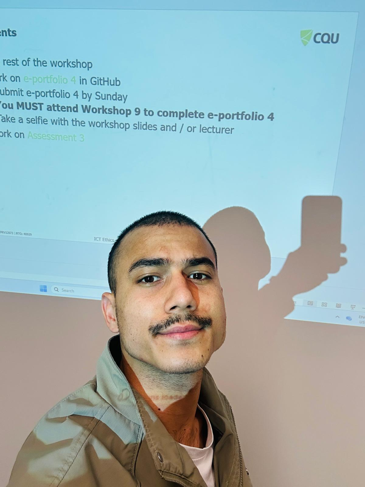
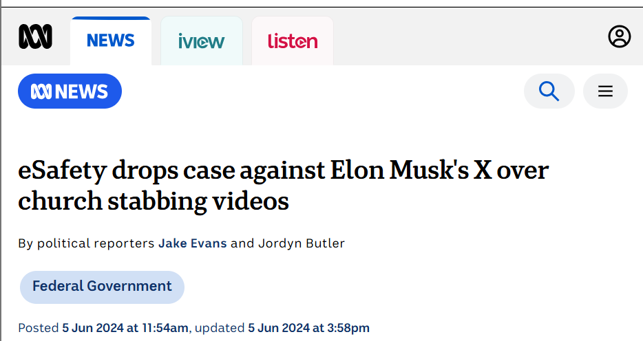
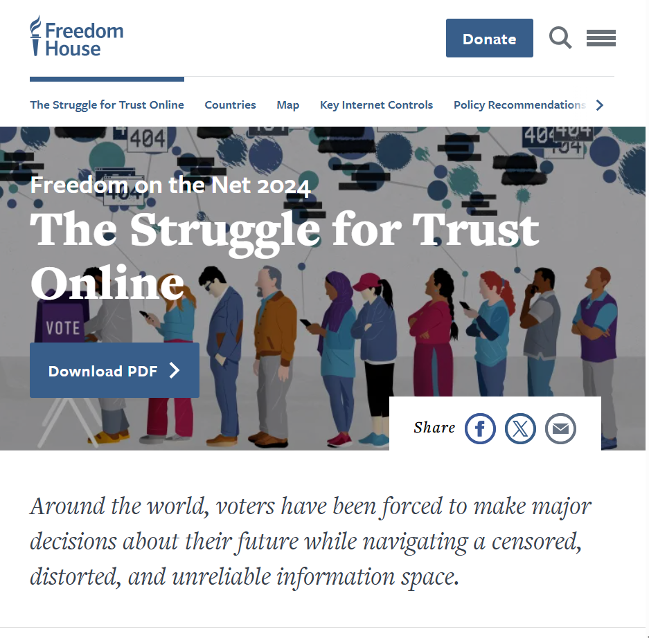
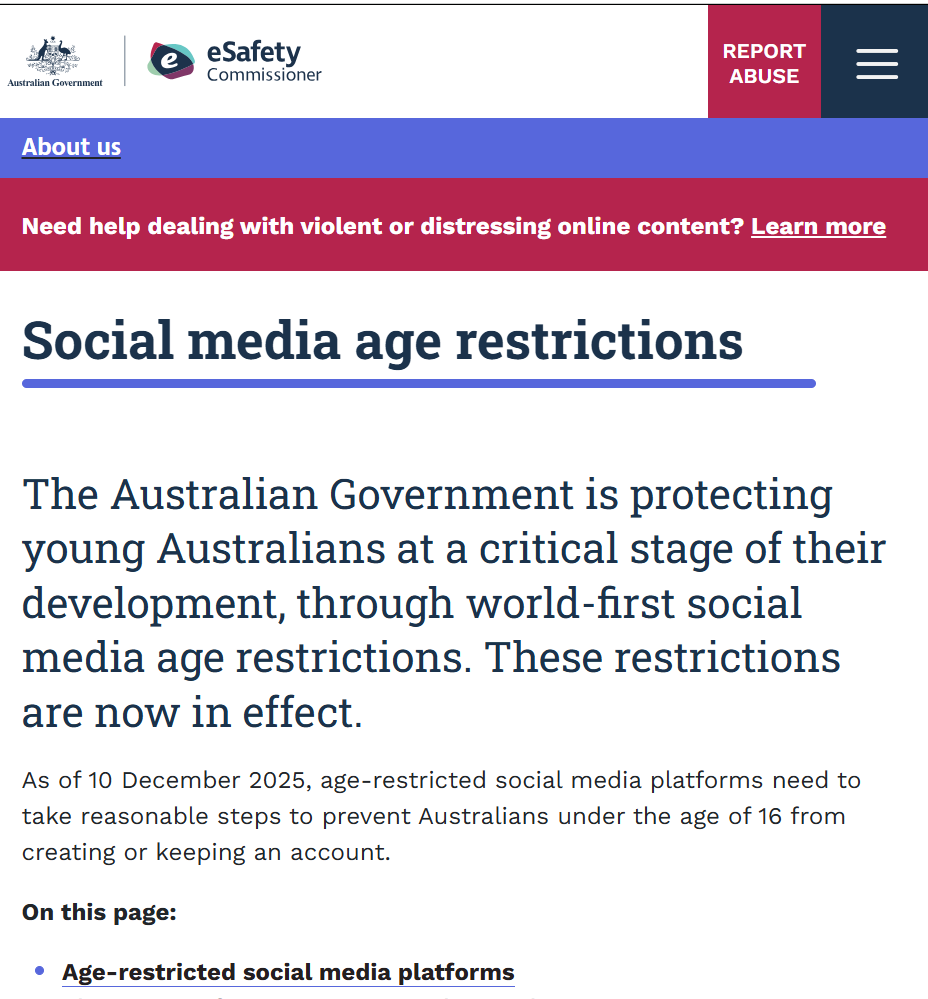
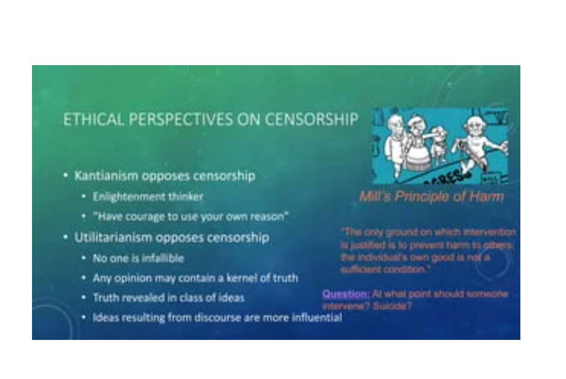

# E-Portfolio 4 – Censorship and Government

**Student Name:** Umesh Kunwar  
**Student Number:** 12301486  
**Unit:** COIT11223 ICT Ethics and Governance in Society  
**Topic:** Censorship and Government  

## Workshop 9 Participation Evidence

This photograph provides evidence of my attendance and participation in the Week 9 workshop on Censorship and Government.

---

## Artefact 1 – eSafety Commissioner vs X: Online Safety and Censorship

**Source:** ABC News – *eSafety drops case against Elon Musk's X over church stabbing videos*

### Summary of the Artefact

The ABC News article discusses the 2024 dispute between Australia's eSafety Commissioner and X concerning access to graphic online content. The legal dispute became an important example of the difficulty governments can face when attempting to regulate content distributed through global internet platforms. The Week 9 workshop also used this case to demonstrate tensions between online safety, government regulation and the global nature of the Internet (Evans & Butler, 2024).

### Reflection and Justification

I selected this artefact because it helped me understand that censorship is not simply about deciding whether harmful content should be removed. Government intervention may protect users from harmful material, but restrictions can also raise questions about freedom of expression and the limits of government authority. 

“I learned that protecting people from harmful online content is important, but governments also need to consider freedom of expression when deciding what information should be restricted.”
This matches the workshop's discussion of the tension between national regulation and global platforms.

---

## Artefact 2 – Freedom on the Net 2024

**Source:** Freedom House – *Freedom on the Net 2024: The Struggle for Trust Online*

### Summary of the Artefact

Freedom House's *Freedom on the Net 2024* examines internet freedom across countries and reports that global internet freedom declined for the fourteenth consecutive year. The report found deterioration in online human rights conditions in 27 of the 72 countries assessed. It demonstrates how censorship, restrictions on information and pressures on online expression can affect people's ability to participate freely in digital environments (Funk, Vesteinsson & Baker, 2024).

### Reflection and Justification

I selected this artefact because it expanded my understanding of censorship beyond Australia. The Week 9 workshop introduced internet freedom around the world and demonstrated that governments use different approaches to regulating online information.

“I learned that internet freedom is different around the world and that government censorship can significantly affect what people are able to access, share and discuss online.”
This connects directly with the workshop's section on internet freedom worldwide.

---

## Artefact 3 – Social Media Age Restrictions in Australia

**Source:** eSafety Commissioner – *Social media age restrictions*

### Summary of the Artefact

Australia's social media age restrictions require age-restricted social media platforms to take reasonable steps to prevent Australians under 16 from creating or keeping accounts. The restrictions took effect on 10 December 2025 and form part of Australia's approach to protecting young people online (eSafety Commissioner, 2026). The policy provides a current example of government regulation affecting access to major digital platforms.

### Reflection and Justification

I selected this artefact because it demonstrates the difficulty of balancing protection from online harm with access to digital platforms. The Week 9 workshop discussed Australia's under-16 social media restrictions as an example of government control of online access.

“I learned that protecting young people from online harm is important, but restricting access to social media can also raise concerns about freedom, privacy and access to information.”
Your workshop presents the under-16 restrictions as raising questions about government control of online access

---

## Artefact 4 – Ethical Perspective on Censorship: John Stuart Mill

**Source:** CQUniversity Australia – Week 9 Workshop: Censorship and Government

### Summary of the Artefact

One important concept I selected from the Week 9 workshop was John Stuart Mill's ethical perspective on censorship. The workshop explained that Mill opposed censorship and supported freedom of expression because individuals and majorities can be mistaken. Open discussion allows ideas to be questioned and tested. The workshop also introduced Mill's harm principle, under which intervention can be justified when it is necessary to prevent harm to other people (CQUniversity Australia, 2026).

### Reflection and Justification

I selected this concept because it gave me an ethical framework for evaluating censorship rather than considering the issue only from a legal or technical perspective.

“I learned from Mill's harm principle that freedom of expression should generally be respected, while restrictions may sometimes be justified when they are necessary to prevent harm to other people.”
This closely reflects the ethical concept taught in your Week 9 slides

---

## Use of Artificial Intelligence

Artificial Intelligence tools were used during the planning and research stages of this e-portfolio. ChatGPT was used to help organise the portfolio structure, identify possible artefacts and understand concepts related to censorship and government regulation. I checked the information against the Week 9 workshop material and original sources. I reviewed and revised the material and developed my final reflections to represent my own learning and workshop experience.

---

## References

CQUniversity Australia 2026, *COIT11223 ICT Ethics and Governance in Society – Week 9: Censorship and Government*, CQUniversity Australia.

eSafety Commissioner 2026, *Social media age restrictions*, Australian Government, viewed 20 September 2026, <https://www.esafety.gov.au/about-us/industry-regulation/social-media-age-restrictions>.

Evans, J & Butler, J 2024, ‘eSafety drops case against Elon Musk’s X over church stabbing videos’, *ABC News*, 5 June, viewed 20 September 2026, <https://www.abc.net.au/news/2024-06-05/esafety-elon-musk-x-church-stabbing-videos-court-case/103937152>.

Funk, A, Vesteinsson, K & Baker, G 2024, *Freedom on the Net 2024: The Struggle for Trust Online*, Freedom House, viewed 20 September 2026, <https://freedomhouse.org/report/freedom-net/2024/struggle-trust-online>.
